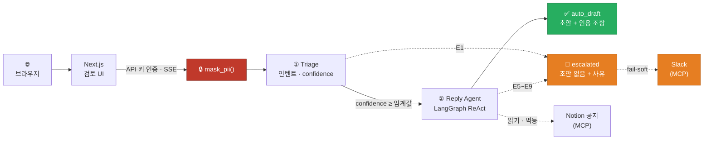
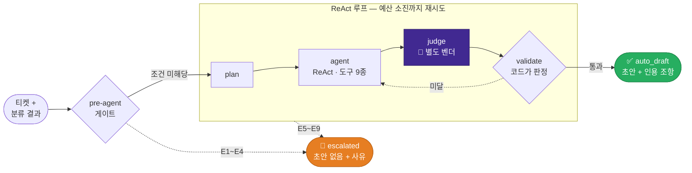
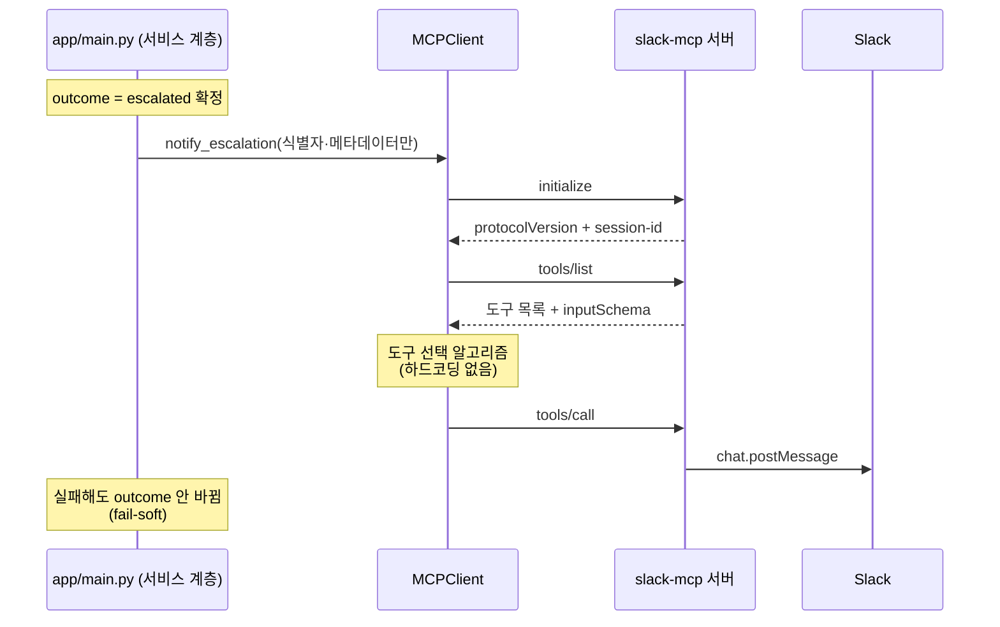
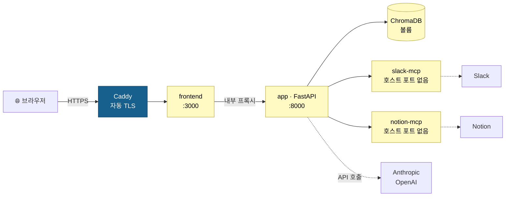

<div align="center">

# CS 티켓 어시스턴트

**이커머스 고객지원 상담원을 위한 AI 어시스턴트 — 티켓 분류 · 답변 초안 생성**


**🚧 Phase 0~12 구현 완료 · 실 배포와 전체 eval만 남음**

[한눈에 보기](#한눈에-보기) · [아키텍처](#아키텍처) · [설계 원칙](#설계-원칙) · [엔지니어링 하이라이트](#엔지니어링-하이라이트) · [품질 평가](#품질-평가) · [빠른 시작](#빠른-시작-로컬) · [배포](#배포) · [남은 과제](#남은-과제)

</div>

---

## 한눈에 보기

고객 문의 티켓을 받아 **유형을 분류**하고, 사내 정책·주문 정보를 근거로 **답변 초안을 생성**해 상담원에게 제시하는 서비스입니다.

| 모듈 | 입력 | 처리 | 출력 |
|---|---|---|---|
| 🏷️ **티켓 분류** | 티켓 본문 | PII 마스킹(모델 호출 **전**) → 단일 LLM 호출 + 구조화 출력 (**에이전트 아님**) | 인텐트(27종) · 카테고리(11종) · confidence |
| ✍️ **답변 초안** | 티켓 + 분류 결과 | LangGraph ReAct 에이전트가 정책 RAG·주문 DB를 참조하며 초안 작성 → **별도 벤더 Judge**가 정책 준수·톤 채점 → 코드가 통과 판정 → 미달 시 재시도 | 초안 + 인용 조항 + 사용 도구, **또는** 에스컬레이션 사유 |

> **자동 응답이 아니라 상담원 증강(human-in-the-loop)입니다.** 모든 출력은 상담원 검토 대상이며, 확신도가 낮으면 **초안을 만들지 않고** 사람에게 넘깁니다.

이 프로젝트가 증명하려는 세 가지:

| # | 증명하려는 것 | 방법 |
|---|---|---|
| 1 | **아키텍처 일반화** | 선행 프로젝트([분필](https://github.com/MachuEngine/bunpil), 교육 도메인)에서 검증한 LangGraph ReAct + RAG + 가드레일 + eval 구조가 전혀 다른 산업 도메인에서도 성립하는지 |
| 2 | **벤더 통합 깊이** | 공식 LangChain 통합(`ChatAnthropic`) · `BaseChatModel` 직접 상속 커스텀 어댑터(RunPod) · **MCP 클라이언트 2종**(Slack 알림=쓰기·루프 밖, Notion 공지=읽기·루프 안)을 전부 구현하고 판단 기준을 문서화 |
| 3 | **개발 과정의 하네스 설계** | 에이전트 제품에 가드레일을 넣는 것과, 에이전트로 개발하는 과정에 가드레일을 넣는 것은 같은 문제라는 관점을 실제 훅·루프로 구현 |

### 구현 현황

| 영역 | 상태 |
|---|---|
| 개발 하네스 (훅 4종 · 보호 경로 · 루프 규칙) — **코드보다 먼저 구축** | ✅ 완료 |
| 티켓 분류 모듈 (단일 호출 + structured output) | ✅ 완료 |
| 답변 초안 에이전트 (ReAct + judge 노드 + validate 노드) | ✅ 완료 |
| **생성 ↔ Judge 벤더 완전 분리** (Anthropic ↔ OpenAI) | ✅ 완료 |
| `save_draft` 결정론적 게이트 6종 | ✅ 완료 |
| 에스컬레이션 E1~E9 (전부 코드가 판정) | ✅ 완료 |
| **라이브 공지 조회 (`check_live_notices`, Phase 12)** | ✅ 완료 — 노션 MCP 실측·어댑터 결선까지 (읽기 전용, 루프 안 도구) |
| RAG (ChromaDB + BGE-M3 + BGE-reranker, 전부 CPU) | ✅ 완료 |
| 평가 체계 (골든셋 7종 431건 + 러너 7종) | ✅ 완료 (스모크셋 기준) |
| **Judge 신뢰도 κ ≥ 0.4** | ✅ 달성 (0.466 — [품질 평가](#품질-평가)) |
| 커스텀 어댑터 (RunPod `BaseChatModel` 상속) | ✅ 코드 완료 · ⏸️ 실 엔드포인트 미검증 |
| 상담원 검토 UI (Next.js + SSE) | ✅ 완료 |
| **Slack 에스컬레이션 알림 (MCP)** | ✅ 완료 (실제 발송까지 e2e 검증) |
| CI (GitHub Actions 경량 파이프라인) | ✅ 완료 |
| 배포 구성 (Docker + Compose + Caddy HTTPS) | ✅ 구성 완료 · ⏸️ 실 클라우드 VM 미배포 |
| 전체 eval (`--full`) | ⬜ 미실행 ([남은 과제](#남은-과제)) |

테스트 **221개 통과** (`pytest -q -m "not rag and not llm_live"` — CI가 매 PR에서 도는 경량 스위트).
전체 수집은 229개이고, 나머지 8개는 임베딩 모델 로드(`rag`)나 로컬 Ollama(`llm_live`)가 필요해 별도 실행합니다.

### 시스템 구성도

**요청 흐름** — 실선이 주 경로, 점선이 부가 경로입니다.



**모듈이 사용하는 자원**

| | 생성 LLM<br/>`claude-sonnet-5` | 🎯 Judge LLM<br/>`gpt-5.6-luna` | ChromaDB<br/>정책 조항 30 | SQLite<br/>주문 · 고객 |
|---|:---:|:---:|:---:|:---:|
| **① Triage** | ✅ | — | — | — |
| **② Reply Agent** | ✅ | ✅ | ✅ | ✅ |
| 벤더 / 위치 | Anthropic | **OpenAI** | 로컬 CPU | 로컬 |

> 🎯 **Judge LLM은 생성 LLM과 다른 벤더**입니다 — 초안을 쓰는 모델이 자기 글을 자기가 채점하지 않도록 의도적으로 분리했습니다(배경은 [설계 원칙](#2-judge는-도구가-아니라-별도-노드이며-생성과-다른-벤더를-쓴다) 참고).

### 도메인을 "얇게" 특화한 이유

특정 버티컬로 좁게 못 박지 않았습니다. 좁히면 (a) 도메인 실무 지식 부족으로 평가 신뢰도가 떨어지고, (b) 포트폴리오 평가 축이 "도메인 지식"으로 오해됩니다. 실제 축은 **에이전트·RAG·가드레일·평가 설계 역량**입니다.

대신 tool·정책·평가를 **구체적으로 정의할 수 있을 만큼만** 좁혔습니다 — 이커머스는 주문조회·반품·배송 tool이 직관적이고, 정책 위반의 정의가 명확하며, 직접 검증이 가능합니다.

사용하는 [Bitext 데이터셋](https://huggingface.co/datasets/bitext/Bitext-customer-support-llm-chatbot-training-dataset)은 스스로를 "customer service **verticalization**용"으로 규정하며, 특정 산업에 종속되지 않는 공통 인텐트 27개만 담고 있습니다. 이 "범용 베이스 → 도메인 특화" 2단계 설계를 그대로 프로젝트 구조로 차용했습니다.

→ "이커머스 CS를 만들었다"가 아니라 **"범용 CS 파이프라인을 도메인에 특화시키는 과정을 재현했다"**.

### 언어 정책

**파이프라인은 영어, 프로젝트 문서는 한국어입니다.** 티켓·정책 문서·프롬프트·생성 초안·PII 패턴은 전부 영어이고, 설계 문서·커밋 메시지·UI 레이블은 한국어입니다.

Bitext 데이터셋이 **영어 전용**이기 때문입니다. 인텐트 라벨이 이 프로젝트의 유일한 외부 ground truth인데, 번역을 끼우면 정확도가 떨어졌을 때 원인이 모델인지 번역인지 분리할 수 없게 됩니다.

---

## 아키텍처

| 구분 | 기술 |
|---|---|
| 백엔드 | FastAPI (비동기) |
| 프론트엔드 | Next.js (`frontend/`) — SSE 스트리밍 |
| 답변 초안 | LangGraph (ReAct) |
| 티켓 분류 | 단일 LLM 호출 + structured output (**에이전트 아님**) |
| RAG | ChromaDB + BGE-M3 임베딩 + BGE-reranker (모두 CPU) |
| 생성 LLM | Anthropic `claude-sonnet-5` (`ChatAnthropic`) |
| Judge LLM | OpenAI `gpt-5.6-luna` — **생성과 다른 벤더** |
| 커스텀 어댑터 | Ollama / RunPod Serverless (`BaseChatModel` 직접 상속) |
| 외부 알림 | MCP 클라이언트 → `zencoderai/slack-mcp` (Streamable HTTP, 쓰기·루프 밖) |
| 라이브 공지 | MCP 클라이언트 → `makenotion/notion-mcp-server` (Streamable HTTP, 읽기·루프 안) |
| 합성 데이터 | SQLite (주문·고객) + 합성 정책 문서 30개 조항 |
| 배포 | Docker + Docker Compose + Caddy HTTPS |

### 답변 초안 모듈 — LangGraph 상태 흐름



실선은 정상 진행, **점선은 재시도·에스컬레이션**(초안 생성 중단)입니다. E1~E9의 내용은 [바로 아래 표](#세-가지-종료-상태)에 있습니다.

**노드 순서(`plan → agent → judge → validate`)는 설계 승인 없이 바꾸지 않습니다.** `judge`는 **도구가 아니라 그래프 노드**이며, 오프라인 eval과 **동일한 함수**(`app/modules/reply/judge.py:judge_reply()`)를 호출합니다 — 그래야 EVAL.md의 Judge 신뢰도 수치가 곧 배포된 Judge의 신뢰도입니다.

### 도구 (Tools)

모든 도구는 **LLM 호출 없이 순수 계산·검색·저장만** 수행합니다. 추론과 문장 작성은 에이전트가 직접 담당합니다 — 도구 안에 LLM을 중첩하는 안티패턴을 배제했습니다.

| 도구 | 역할 |
|---|---|
| `search_policy` | 정책 조항 검색 (ChromaDB + BGE-reranker) |
| `lookup_order` | 주문 상태·배송 추적 조회 (합성 SQLite) |
| `check_customer_tier` | 고객 등급 조회 (등급별 정책 분기용) |
| `check_live_notices` | 운영자가 쓴 라이브 공지 조회 — 정적 RAG가 못 다루는 "지금 유효한 정보" (MCP, 읽기·멱등, async) |
| `validate_draft_format` | 초안 형식 검증 (결정론적) |
| `save_draft` | **게이트 6종 통과 시에만** 저장 |
| `discard_draft` | 초안 폐기 (교체 시) |
| `escalate_to_human` | 스스로 처리 불가 판단 시 명시적 신호 (→ E5) |
| `submit_for_review` | 작성 완료 신호 |

### `save_draft`의 결정론적 게이트 6종

거부 시 **사유를 도구 응답으로 되돌려** 에이전트가 스스로 교정하게 합니다.

| # | 게이트 | 검사 내용 |
|---|---|---|
| ① | **PII 재유출** | 마스킹되지 않은 **원본** PII 패턴이 초안에 있는가 (마스킹 토큰 `{{EMAIL}}` 자체는 허용) |
| ② | **근거 없는 확약** | 도구 결과(`tool_results_log`)에 없는 금액·날짜·환불 확약이 있는가 |
| ③ | **금지 표현** | 법적 확약·타사 비방·과장 (블랙리스트) |
| ④ | **정책 인용 존재** | 정책 판단이 필요한 인텐트인데 인용 조항이 0건인가 |
| ⑤ | **상담원 책임 고지** | 필수 고지 문구가 누락됐는가 — *모델이 프롬프트 지시를 빼먹는 경우가 실측되어 게이트로 강제* |
| ⑥ | **라이브 공지 인지 누락** | 공지 조회가 필수인 인텐트인데 조회를 안 했거나, 활성·scope 일치 공지를 `applied_notices`에 명시하지 않았는가 (본문 반영까지는 강제하지 않음 — 무관한 공지를 억지로 끼워넣는 유인을 피하기 위해) |

> ⑤가 있는 이유: **프롬프트만 믿지 않습니다.** "고지 문구를 반드시 넣어라"라고 지시해도 모델이 빠뜨리는 사례가 실제로 관측됐고, 안전 요구사항을 확률적 준수에 맡길 수 없어 코드 게이트로 승격했습니다.

### 세 가지 종료 상태

선행 프로젝트는 "통과 / 예산 소진" 2상태였지만, CS는 **에스컬레이션을 1급 종료 상태**로 뒀습니다. 실제 프로덕션 CS 패턴(컨피던스 임계값 라우팅)과 일치합니다.

| 상태 | 조건 | 상담원이 보는 것 |
|---|---|---|
| `auto_draft` | 에스컬레이션 미해당 & Judge 통과 & 코드 검증 통과 | 초안 + 인용 정책 + 사용 도구 |
| `escalated` | 아래 9개 조건 중 하나라도 해당 | **초안 없음** + 사유 + 🔔 Slack 알림 |
| `failed` | 파이프라인 예외 | 오류 표시 (내부 상세 비노출) |

**에스컬레이션 조건 9종** — 판정은 전부 **코드**가 하며, 정의는 `app/modules/reply/routing.py` 한 곳에만 둡니다(프롬프트·게이트·eval이 같은 표를 참조).

| | 조건 | 판정 시점 | | 조건 | 판정 시점 |
|---|---|---|---|---|---|
| E1 | 분류 confidence < 임계값 | pre-agent | E5 | 에이전트가 `escalate_to_human` 호출 | 루프 중 |
| E2 | 고객이 사람을 명시 요청 | pre-agent | E6 | 주문 조회 실패 | 루프 중 |
| E3 | `complaint` (보상·책임 판단) | pre-agent | E7 | `save_draft` 게이트 3연속 실패 | 루프 중 |
| E4 | `flags`에 `W`(공격적 표현) | pre-agent | E8 | 재시도 예산 소진 | validate |
| | | | E9 | 공지 조회 필수 인텐트인데 조회 실패 | 루프 중 |

> **초안이 없는 것이 잘못된 초안보다 낫습니다.** 예산 소진 시 마지막 미달 초안을 그냥 내보내지 않습니다.
>
> E3(불만)을 자동 초안에서 뺀 이유: 보상 여부·금액 판단이 섞이는데 이건 정책 문서만으로 결정되지 않는 **제품 판단**입니다.
>
> E9 우선순위는 `E6 > E9 > E5 > E7`입니다(더 구체적인 근본 원인 우선 — E6과 같은 논리). `NOTICE_SOURCE`가 미설정(noop)이면 E9가 아닙니다 — 기능 비활성과 조회 실패를 구분합니다.

### MCP — 에스컬레이션 알림 (Phase 11)

`escalated`는 판정만 정확하고 **실제로 사람을 부르는 경로가 없는 막다른 길**이었습니다. MCP로 Slack 알림을 붙여 HITL의 후반부를 채웠습니다.



**설계 결정 3가지** (상세: [MCP_INTEGRATION.md](./MCP_INTEGRATION.md))

| 결정 | 이유 |
|---|---|
| MCP 호출을 **`tools.py`에 넣지 않고** `app/main.py`(서비스 계층)에서만 | 도구는 순수 계산만이라는 규칙과 충돌 + 도구는 동기 호출 + 재시도 루프 안이라 **중복 발송** 위험 |
| **fail-soft** (LLM 백엔드의 fail-fast와 의도적으로 반대) | 알림 실패가 멀쩡한 `escalated`를 `failed`로 뒤집으면 안 됨 |
| 도구 이름 **하드코딩 금지** — `tools/list`로 발견 | MCP의 핵심 가치가 발견 가능성. 실측에서 스키마만으로 필터하면 `slack_reply_to_thread`(채울 수 없는 `thread_ts` 필요)를 잘못 고르는 걸 확인해 **필수 인자 충족 가능성** 필터를 추가 |

**Slack 페이로드** — 하드룰 3(사용자 입력 비저장) 준수:

| 포함 | `ticket_ref` · 내부 `REQ-` ID · intent · category · confidence · 에스컬레이션 사유 코드+설명 · 발생 시각 |
|---|---|
| **제외** | 티켓 본문 · 초안 전문 · `customer_id` · 이메일/전화/카드/주소/인명 |

> 인터페이스 시그니처가 **키워드 인자 개별 나열**(dict 아님)인 것도 구조적 방어입니다 — 티켓 본문이나 초안을 실수로 넘길 수 있는 경로 자체를 없앴습니다. 테스트가 이 시그니처를 단정합니다.

---

## 설계 원칙

### 1. LLM이 판단하고, 코드가 결정한다

| 검증 대상 | 판단 주체 | 근거 |
|---|---|---|
| 정책 준수 · 톤 적절성 | **별도 벤더 Judge LLM** → threshold는 코드 | 정성 판단은 LLM이 낫고, 커트라인은 코드가 안정적 |
| 사람 개입 필요 여부 | LLM이 confidence 기록 → **코드가 임계값 비교** | 라우팅 결정을 LLM에 맡기면 제어가 깨짐 |
| PII 재유출 · 근거 없는 확약 · 고지 누락 | **코드** (`save_draft` 게이트 6종) | 안전 검사는 확률적 판단에 맡기지 않음 |
| 재시도 · 에스컬레이션 여부 | **코드** (budget 루프 · E1~E9) | — |

### 2. Judge는 도구가 아니라 별도 노드이며, 생성과 다른 벤더를 쓴다

선행 프로젝트에서 얻은 교훈입니다. 처음에는 생성 에이전트가 도구로 **자기 출력을 스스로 채점**했는데, 그 신뢰도는 사람 라벨과 한 번도 대조된 적이 없었고, 정작 오프라인 평가가 검증하는 Judge와 런타임에 배포된 Judge가 **서로 다른 코드 경로**였습니다(검증-배포 불일치).

이 프로젝트는 **처음부터** `judge_node`가 오프라인 평가와 동일한 함수를 호출하도록 설계했습니다. 또한 Judge는 생성 모델과 **다른 벤더**(Anthropic ↔ OpenAI)를 씁니다 — "생성 모델이 자기 글을 자기가 채점하지 않는다"의 가장 강한 형태입니다.

### 3. 보안 하드룰 (예외 없음)

실제 고객 데이터 미사용(공개 데이터셋 + 합성) · **PII 마스킹은 모델 호출 이전** · 티켓 본문 비저장 · 로그·캐시에 PII 금지 · 근거 없는 확약 금지 · 서버 간 API 키 인증 · 출력에 **"상담원 최종 책임(보조수단)" 고지**.

CS 도메인에는 교육 도메인에 없던 문제가 하나 있습니다 — **모든 식별자를 마스킹하면 도구가 동작하지 않습니다.**

| 구분 | 대상 | 처리 |
|---|---|---|
| **마스킹** | 이메일 · 전화번호 · 카드번호 · 주소 · 인명 | `{{EMAIL}}` 등으로 치환 |
| **유지** | 주문번호 · 송장번호 · 고객ID | 그대로 — `lookup_order`의 입력 |

초안에 마스킹 토큰이 남는 것은 **정상**이며, 상담원이 검토 단계에서 복원합니다("상담원 최종 책임" 원칙과 일관).

### 4. 개발 하네스 — 제품 가드레일과 같은 논리를 개발 과정에도

> **에이전트 제품에 가드레일을 넣는 것과, 에이전트로 개발하는 과정에 가드레일을 넣는 것은 같은 문제입니다.** 둘 다 모델의 협조에 의존하지 않는 시스템 레벨 강제가 필요합니다.

**핵심 원칙: 평가의 정답셋과 평가 실행 코드는 개발 에이전트가 수정할 수 없어야 한다.**

| 층 | 수단 | 성격 |
|---|---|---|
| Layer 1 | `CLAUDE.md` | 판단 기준 — 모델의 협조에 의존 |
| Layer 2 | `.claude/settings.json` `permissions.deny` | 선언적 1차 방어 |
| Layer 3 | `.claude/hooks/*.py` (PreToolUse, exit 2) | 우회 경로까지 차단하는 2차 방어 |

**차단 대상**: 보호 경로(`evals/golden/`, `evals/runners/`, `data/raw/`) 쓰기 · API 키 패턴 · `.env` 열람/전송(`cat`·`curl` 등 Bash 우회 포함) · 전체 평가(`--full`) 무단 실행.

**루프 규칙**: 최대 3회 시도 후 중단하고 "무엇을 가정했고 무엇이 틀렸는지" 보고. **테스트를 완화하거나 skip해서 통과시키는 것은 실패로 간주.** 같은 실패 패턴이 3회 기록되면 훅으로 승격시킵니다 — "기억하기"에서 "실행 불가능하게 만들기"로.

> 상세는 [HARNESS_ENGINEERING.md](./HARNESS_ENGINEERING.md).

---

## 엔지니어링 하이라이트

실제로 발견하고 고친 문제들입니다. 대부분 **로컬 소형 모델에서는 안 드러나다가 실제 프론티어 모델로 바꾸자마자 드러난** 것들입니다.

| 문제 | 진단 | 해결 |
|---|---|---|
| **Judge가 정책 조항 본문을 한 번도 받은 적이 없었음** (Phase 6부터 존재) — 실제 모델로 `tone_golden` 후보를 생성하니 60건 중 **59건이 escalated**(정상이면 auto_draft 다수) | `judge_reply()`에 `cited_policies`(조항 ID 문자열 `["TIER-02"]`)만 전달되고, `search_policy()`가 실제로 검색한 **조항 본문은 한 번도 전달되지 않았음**. 그런데 루브릭은 "인용된 조항이 실제로 보여준 것과 부합하는가"를 채점하라고 지시 — Judge는 검증할 근거 없이 채점해온 것. 로컬 Ollama Judge에서는 이 결함이 덜 드러났을 뿐 | `tool_results_log`(게이트②가 이미 쓰던 세션 로그)를 `judge_node` → `judge_reply()`로 배선하고 `retrieved_context`로 노출. 재실행 결과 auto_draft 비율 **1/60 → 30/57(약 53%)** 로 정상화 |
| Judge가 **자기가 만들지 않은 문구를 톤 감점** — 필수 고지문("This is a draft prepared by an AI assistant...")을 `inappropriate_tone` 위반으로 플래그 | 위 버그를 추적하며 같은 트레이스에서 발견. 시스템이 모든 초안에 append하는 문구인데 Judge는 에이전트가 쓴 것으로 취급 | `judge_reply.md`에 "이 줄은 시스템이 붙인 것이니 톤 감점·위반 플래그 대상이 아니다"를 명시 |
| **Judge가 "정확하지만 딱딱한" 초안을 전부 5점** 처리 — κ가 0.4를 못 넘음 | 톤 골든셋에 3점대(정확하지만 인사·고객 상황 언급 없이 조항만 나열) 사례를 추가하니, 4건 중 **4건 전부 Judge가 5점**. 즉 "명백히 나쁜가"는 잘 가르는데 "정확함"과 "좋은 응대"를 구분 못 하는 상태 | 데이터를 더 넣어 임계값을 넘기는 대신 **루브릭의 공백**으로 판단 — "사실 정확성은 5점의 필요조건이지 충분조건이 아니다" + 자연어로 고객 상황을 언급하지 않으면 3점 상한. **κ 0.397 → 0.466 (PASS)** |
| **κ가 음수(-0.081)로 나옴** — 정확 일치율은 80%인데 | 사람·Judge 라벨이 둘 다 5점에 극단적으로 몰린 분포. 우연 일치 확률(`pe`)이 이미 높게 추정돼 실제 이견이 없어도 κ가 음수로 튀는 **카파 역설**. 근본 원인은 `tone_golden`이 *이미 게이트를 통과한 `auto_draft`만* 모은 표본이라 나쁜 톤이 구조적으로 없다는 것 | 골든셋을 임의 수정하지 않고 **근거와 함께 보고**(프로젝트 규칙). 이후 사람 승인 하에 나쁜/중간 톤 사례 10건을 **같은 티켓 맥락 위에 손으로 작성**해 추가 |
| `claude-sonnet-5`가 **`temperature` 파라미터를 400으로 거부** | 신형 모델에서 해당 파라미터가 제거됨. 로컬 Ollama로 개발할 때는 드러날 수 없던 문제 | `get_chat_anthropic()`·`AnthropicJudgeBackend`에서 파라미터 제거. 실 API 직접 호출로 먼저 확인 후 반영 |
| MCP 도구 선택이 **스키마 필터만으로는 잘못된 도구를 고름** | 실제 `zencoderai/slack-mcp` 컨테이너를 띄워 `tools/list`를 받아보니, `slack_reply_to_thread`도 채널+텍스트 스키마를 만족해 통과 — 하지만 `thread_ts`(우리가 채울 수 없는 값)가 필수라 호출하면 실패 | 선택 알고리즘에 **필수 인자 충족 가능성** 필터 추가(명시 지정 → 스키마 형태 → 필수 인자 충족 → 이름 힌트 랭킹). 실제 스키마 + 비관습적 이름(`conversations_add_message`) 양쪽으로 테스트 |
| MCP 스펙 세대 오판 — 최신 stateless 스펙(2026-07-28)을 전제로 설계 시작 | 실제 대상 서버를 컨테이너로 띄워 `initialize`를 보내보니 `protocolVersion: "2025-03-26"` + `mcp-session-id` 헤더 = **stateful 세대**. 문서 추정이 아니라 실측으로 확인 | SDK를 `mcp>=1.28,<2`로 핀(상한 포함 — 과거 `transformers` 무상한 의존성 사고가 선례). stateless 전환 경로는 문서에 남기되 지금은 적용 안 함 |
| 무관한 테스트들이 **조용히 실제 네트워크 호출** | 개발자 로컬 `.env`에 `MCP_NOTIFIER=slack`이 있어, MCP와 무관한 기존 테스트들이 실제 DNS/네트워크를 시도. fail-soft 설계 덕에 "통과"하고 있어서 안 보였음 | `tests/conftest.py`에 autouse 픽스처로 MCP 관련 env를 전부 격리 |

---

## 품질 평가

> 지표 전체 목록·골든셋 현황·실행 이력은 [EVAL.md](./EVAL.md)에서 계속 갱신합니다. 아래는 스냅샷입니다.
> **⚠️ 측정 모델이 지표별로 다릅니다** — 아래 표에 명시했습니다. 아직 **`--sample 20` 스모크셋 기준**이며 `--full`은 미실행([남은 과제](#남은-과제)).

### 골든셋 7종 (431건, 전부 `evals/golden/*.jsonl` 외부화)

| 파일 | 건수 | 구성 |
|---|---|---|
| `triage_golden.jsonl` | 200 | 인텐트당 7~8건 층화 샘플링 |
| `pii_golden.jsonl` | 50 | 합성 PII 주입 (가제티어 밖 이름 2건 포함) |
| `policy_violation_golden.jsonl` | 50 | 무근거확약 20 · 정책모순 15 · 인용누락 10 · 범위밖약속 5 |
| `escalation_golden.jsonl` | 40 | E1~E4/E6+대조군 30건 결정론적 · E5/E7/E8 10건 best-effort |
| `retrieval_golden.jsonl` | 32 | 실제 조항 30개 전수 커버 + 복수정답 질의 2건 |
| `tone_golden.jsonl` | 40 | 실제 `auto_draft` 30건 + 나쁜/중간 톤 손수 작성 10건 (전부 사람 라벨) |
| `notices_golden.jsonl` | 19 | 활성+scope일치 5 · scope불일치 5 · 비활성 5 · 조회실패 4 (전부 결정론적) |

### 답변 초안 — 실제 프론티어 모델 (생성 `claude-sonnet-5` / Judge `gpt-5.6-luna`, 2026-07-29~30)

| 지표 | n | 기준 | 실측 | |
|---|---|---|---|---|
| **Judge 신뢰도 (Cohen's κ)** | 40 | ≥ 0.4 | **0.466** | ✅ |
| Judge 신뢰도 (±1 일치율) | 40 | 참고값 | 0.975 | |
| 에스컬레이션 recall (E1~E4+E6, 결정론적) | 20 | ≥ 0.90 | **1.000** | ✅ |
| ├ precheck 정확도 (E1~E4) | 20 | — | 1.000 | ✅ |
| └ E6 recall | 5 | — | 1.000 | ✅ |
| `save_draft` 게이트 recall (②/④) | 20 | — | **1.000** | ✅ |
| Judge 위반 검출 recall | 20 | ≥ 0.95 | 0.850 | ⚠️ |
| 에스컬레이션 FP율 (대조군) | 5 | 참고값 | 0.800 | ℹ️ |
| best-effort recall (E5/E7/E8) | 10 | 참고값 | 0.700 | ℹ️ |

- **Judge 신뢰도가 이번에 처음 목표 달성** — 라운드 4회에 걸쳐 골든셋을 넓히고 루브릭 공백을 고친 결과([엔지니어링 하이라이트](#엔지니어링-하이라이트) 참고). 다만 이건 "영원히 검증 완료"가 아니라 **이번 40건 표본·이번 루브릭 버전에서의 측정치**입니다.
- **위반 검출 recall 0.85 미달은 골든셋을 고치지 않고 보고했습니다.** 놓친 3건을 확인하니 Judge는 세 건 모두에서 high-severity 위반을 **실제로 잡아냈고**, 다만 `unsupported_commitment`가 아니라 `missing_citation`으로 분류했습니다. 세 건 다 근거 자체가 비어 있어 두 라벨이 사실상 같은 지적이 되는 케이스 — **Judge 실패가 아니라 골든셋의 유형 경계 문제**로 보이며, 유형 통합 여부는 사람 판단으로 남겼습니다.
- **FP율 0.8은 표본 노이즈로 판단.** n=5에서 4건인데, 그중 ESC-026을 단독 재실행하니 `policy=5, tone=5, auto_draft`로 정상 통과했습니다. DESIGN.md가 이 지표를 참고값으로 둔 이유가 이것입니다.

### 에이전트가 도구를 제대로 쓰는가 — 실행 로그 사후 검증

위 지표들과 별개로, **에이전트가 실제로 RAG·DB 도구를 호출하고 그 결과만 인용하는지**를 `tone_golden`에 저장된 `tool_results_log`(실제 파이프라인 실행분 30건)로 사후 검증했습니다.

| 검증 항목 | 결과 | |
|---|---|---|
| 정책 인용 **필수** 인텐트에서 `search_policy` 호출 | **18 / 18** | ✅ |
| `search_policy` 미호출 2건 | 둘 다 `track_order` — **인용 불필요 인텐트** | ✅ |
| `lookup_order` **필수**인데 미호출 | **0건** | ✅ |
| 도구 결과가 아예 빈 실행 | **0건** | ✅ |
| 초안의 대괄호 인용 60건 중 **검색 결과에 없는 조항** | **0건** | ✅ |

즉 에이전트가 인텐트에 맞게 도구를 선택하고, **검색해온 조항만 인용**하고 있습니다(지어낸 조항 ID 0건). 이 사후 검증이 가능한 이유는 조항 **본문**이 `tool_results_log`에 남기 때문인데, 이 필드는 원래 게이트②용이었고 Judge에 전달되지 않던 것을 [버그 수정](#엔지니어링-하이라이트) 때 배선한 것입니다.

> ⚠️ 다만 이건 "도구를 **호출**했는가"이지 "**옳은 질의**로 불렀는가"가 아닙니다 — 후자는 아직 측정 수단이 없습니다([미측정 지표](#미측정-지표-알려진-공백)).

### 티켓 분류 · PII · 검색 (로컬 Ollama `qwen2.5:14b`, 2026-07-28)

| 지표 | n | 기준 | 실측 | |
|---|---|---|---|---|
| PII 마스킹 누락률 (FN) | 20 | = 0 | **0.000** | ✅ |
| 정책 RAG Recall@5 <sup>†</sup> | 20 | ≥ 0.80 | **1.000** | ✅ |
| 정책 RAG MRR <sup>†</sup> | 20 | 참고값 | 0.896 | |
| 인텐트 정확도 (27-class) | 20 | ≥ 0.85 | **0.850** | ✅ |
| 인텐트 macro-F1 | 20 | ≥ 0.80 | **0.821** | ✅ |
| 카테고리 정확도 (11-class) | 20 | ≥ 0.92 | 0.900 | ⚠️ |
| confidence 캘리브레이션 | 20 | 오분류가 더 낮은가 | 0.847 vs 0.800 | ✅ |

- PII 마스킹은 규칙 기반이라 모델과 무관하게 안정적입니다.
- <sup>†</sup> **검색 수치는 LLM과 무관한 BGE-M3 + reranker 순수 성능입니다.** `run_retrieval.py`는 에이전트·`search_policy` 도구를 우회해 `get_retriever()`를 직접 호출하고, 질의도 골든셋에 사람이 써둔 이상적 질의를 씁니다(런타임은 모델이 질의를 만들고 `top_k=3`, eval은 `top_k=5`). **에이전트 검색 성능으로 읽으면 안 됩니다.**
- **카테고리 정확도 미달(0.900 vs 0.92)은 20건 중 2건 오분류**라 표본 노이즈일 가능성이 커, 이 시점에 `app/`을 고치지 않았습니다 — `--full`(200건) 재확인 필요.
- macro-F1을 함께 보는 이유는 불균형 보정이 아니라(Bitext는 인텐트당 ~1,000건으로 균등) **인접 인텐트 쌍의 국소 붕괴 탐지**입니다. 실제로 `change_shipping_address ↔ set_up_shipping_address` 혼동 1건이 관측됐고, 이는 DESIGN.md가 예상한 패턴과 일치합니다.

### 미측정 지표 (알려진 공백)

| 지표 | 왜 아직 못 쟀는가 |
|---|---|
| **에이전트가 생성한 질의의 검색 품질** | `run_retrieval.py`는 `get_retriever()`를 **직접** 호출하며 질의도 골든셋에 사람이 손으로 써둔 것(`"Can I cancel an order that has already shipped?"`)을 씁니다. 즉 재는 대상은 "질의가 이상적일 때 임베딩+리랭커가 옳은 조항을 올리는가"이지, **런타임에 모델이 스스로 만든 질의의 품질이 아닙니다.** 게다가 런타임 `search_policy`는 `top_k=3`, eval은 `top_k=5`라 조건도 다릅니다 — `recall@5=1.0`을 에이전트 성능으로 읽으면 안 됩니다 |
| 톤 평균 ≥ 4.0 | `tone_golden`은 κ 측정용으로 선별된 40건이라 "실제 배치의 평균"을 대표하지 못함 — `--full` 단계에서 더 큰 배치로 별도 측정 필요 |
| 정책 위반 검출 F1 | `policy_violation_golden`에 위반이 **있는** 양성 예시만 있고 대조군(clean draft)이 없어 precision 계산 불가. Recall만 측정 가능 |
| PII FP율 | 비-PII를 잘못 마스킹하는 케이스의 골든 데이터가 아직 없음 |
| 과정 지표 (평균 반복수·도구 호출수·latency) | 별도 러너 없음 — `--full` 실행 시 부가 수집 예정 |

---

## 빠른 시작 (로컬)

### 1. 환경 설정

```bash
git clone https://github.com/MachuEngine/cs-assistant.git
cd cs-assistant

python -m venv .venv
source .venv/bin/activate      # Windows: .venv\Scripts\activate
pip install -r requirements.txt

cp .env.example .env           # 값 채우기 (아래 환경변수 표 참고)
```

### 2. 데이터 준비 · RAG 인덱싱

```bash
.venv/bin/python scripts/download_bitext.py        # Bitext 데이터셋 (재배포 대신 다운로드)
.venv/bin/python scripts/build_synthetic_data.py   # 합성 정책 문서 + 주문·고객 SQLite (시드 고정)
.venv/bin/python scripts/hydrate_tickets.py        # 플레이스홀더 → 실제 주문번호 주입 (10%는 존재하지 않는 번호)
.venv/bin/python scripts/index_policies.py         # 정책 문서 → ChromaDB
```

> 이미 적재된 컬렉션은 자동 스킵(idempotent). 처음 한 번만 실행하면 됩니다.

### 3. 서버 실행

터미널 2개를 사용합니다. `app/main.py`는 정적 파일을 서빙하지 않으므로 UI를 보려면 프론트엔드도 띄워야 합니다.

```bash
# 터미널 1 — FastAPI (포트 8000)
.venv/bin/uvicorn app.main:app --host 0.0.0.0 --port 8000

# 터미널 2 — 프론트엔드 (포트 3000)
cd frontend
npm install                    # 최초 1회
cp .env.example .env.local     # CS_API_KEY는 루트 .env와 동일한 값으로
npm run dev
```

브라우저에서 **http://localhost:3000** 접속.

<details>
<summary><b>입력 예시 — 세 가지 outcome 확인하기 (펼치기)</b></summary>

```text
# auto_draft 기대 — 배송 조회
can you help me tracking order ORD-000003?

# auto_draft 기대 — 정책 질문 (주문 무관)
what payment methods do you accept?

# escalated 기대 — 존재하지 않는 주문번호 (E6)
I need to cancel order ORD-999999 right away

# escalated 기대 — 사람 상담원 요청 (E2)
I don't want to talk to a bot, please connect me to a real human agent

# escalated 기대 — 불만/보상 (E3)
This is the third time my order has been late and I want compensation
```

</details>

### 4. 테스트 · 평가

```bash
pytest -q -m "not rag and not llm_live"                 # 221개, 모델 호출 없음

.venv/bin/python evals/runners/run_triage.py --sample 20        # 스모크셋
.venv/bin/python evals/runners/run_judge_reliability.py --sample 40
.venv/bin/python evals/runners/run_notices.py --sample 20       # 라이브 공지(19건 전수)
```

> `--full`은 훅이 차단합니다 — 비용과 변동성 때문에 **사람이 직접** 실행합니다.

---

## 배포



노란색이 `docker compose`가 띄우는 서비스입니다.

```bash
docker compose up -d --build     # app + frontend + slack-mcp + notion-mcp
```

- `slack-mcp`·`notion-mcp`는 `expose`만 하고 **호스트 포트를 열지 않습니다** — 내부 네트워크에서만 접근 가능.
- Caddy는 `frontend`(3000)만 바라보면 되고, `frontend/app/api/*/route.ts`가 컨테이너 내부에서 FastAPI로 프록시합니다.
- CI(`.github/workflows/ci.yml`)는 매 PR에서 pytest + 백엔드 import 스모크 + 프론트 lint/build를 돌립니다. **모델 호출 없음** — 전체 eval은 CI에서 자동 실행하지 않습니다(변동성 + 비용).

---

## 남은 과제

| 항목 | 상태 | 비고 |
|---|---|---|
| **`--full` 규모 전체 eval 6종** | ⬜ 미실행 | 훅이 자동 실행을 차단 — 사람이 직접. 특히 `category_accuracy` 0.900(기준 0.92)이 표본 노이즈인지 확인 필요 |
| Judge 위반 검출 recall 0.85 처리 방침 | ⏸️ 사람 판단 대기 | 골든셋 유형 경계 문제로 결론 — 유형 통합 여부는 사람이 결정 |
| 톤 평균 / 위반 F1 / PII FP율 / 과정 지표 | ⬜ 미측정 | `--full` 실행 시 부가 측정 |
| 라이브 공지 지표 게이트화 | ⏸️ 보류 | 첫 사이클은 리포트만(`grounded_accuracy` 1.0 / 게이트⑥ 5/5). 2~3회 이력 후 `check_thresholds.py` 편입 여부를 사람이 결정 |
| RunPod 실제 엔드포인트 e2e | ⏸️ 보류 | `RUNPOD_API_KEY` / `RUNPOD_ENDPOINT_ID` 미설정 (코드·테스트는 완료) |
| 실제 클라우드 VM 배포 (공개 HTTPS URL) | ⏸️ 보류 | 실 클라우드 계정 필요 |

---

## 데이터

### Bitext 데이터셋 (실측 검증 — 2026-07-28)

| 항목 | 확인된 값 |
|---|---|
| 규모 | 26,872 QA 쌍 (인텐트당 약 1,000건 — 분포 균등) |
| 인텐트 / 카테고리 | **27개 / 11개** (`ACCOUNT` `CANCEL` `CONTACT` `DELIVERY` `FEEDBACK` `INVOICE` `ORDER` `PAYMENT` `REFUND` `SHIPPING` `SUBSCRIPTION`) |
| 언어 / 라이선스 | 영어 전용 / **CDLA-Sharing-1.0** (share-alike) |
| 엔티티 | `{{Order Number}}` 형식 플레이스홀더 약 30종 |

`flags`는 언어 생성 태그(정중·구어·오타·공격적 표현 등)로, 파이프라인이 실제로 사용합니다 — **`W`(공격적 표현)는 에스컬레이션 조건 E4**입니다.

> ⚠️ **`response` 컬럼은 정답셋으로 쓰지 않습니다.** 플레이스홀더가 박힌 범용 템플릿이고 우리 정책 문서에 근거하지 않기 때문입니다. 이걸로 채점하면 "우리 정책에 맞는 답"이 아니라 "Bitext 템플릿과 비슷한 답"을 평가하게 됩니다. RAG 코퍼스 적재도 금지 — 영어 CS 문체 참고용으로만 씁니다.

> ⚠️ **플레이스홀더는 실제 값이 아닙니다.** `{{Order Number}}`는 문자열 리터럴이라 그대로 두면 `lookup_order`가 조회할 대상이 없습니다. 합성 DB를 먼저 만들고 그 값을 주입하는 **하이드레이션 단계**를 거치며, 이때 약 10%는 의도적으로 존재하지 않는 주문번호로 채워 **에스컬레이션 경로(E6)가 실제로 발생하도록** 했습니다.

### 합성 데이터

| 항목 | 내용 | 용도 |
|---|---|---|
| 정책 문서 | 가상 이커머스사 영문 규정, **조항 번호 부여**(`RET-03` 등) 30개 조항, 등급·기한 분기 포함 | 정책 RAG 코퍼스 · 인용 근거 |
| 주문·고객 DB | SQLite (`orders` / `customers`, tier 3종) | `lookup_order` · `check_customer_tier` |

> **PII 골든셋이 따로 필요한 이유**: Bitext는 이미 익명화돼 있어 **마스킹할 실제 PII가 없습니다.** 🔴 안전 지표인 마스킹 누락률을 측정하려면 PII를 주입한 테스트셋이 반드시 있어야 합니다.

**⛔ 절대 금지**: 실제 고객 문의·주문 정보·식별 가능한 개인정보 수집. `data/raw/`는 커밋하지 않고 다운로드 스크립트로 재현합니다.

---

## 디렉토리 구조

```
cs-assistant/
├── app/
│   ├── common/
│   │   ├── llm/          # LLM 추상화 (Anthropic / OpenAI / Ollama / RunPod + ChatRunPod)
│   │   ├── mcp/          # MCP 클라이언트 (base / client / factory / backends)
│   │   │   └── notices/  # 라이브 공지 조회(Phase 12) — base / activity / factory
│   │   │                 # backends(noop / stub / notion)
│   │   ├── rag/          # 청킹, 임베딩, 리랭킹, ChromaDB
│   │   └── privacy.py    # mask_pii — 모델 호출 전에만 호출
│   ├── modules/
│   │   ├── triage/       # 티켓 분류 (단일 호출 + structured output)
│   │   └── reply/        # graph.py(LangGraph) / tools.py(도구 9종)
│   │                     # judge.py(채점 함수) / routing.py(E1~E9 · 인텐트→도구 매핑)
│   └── main.py           # FastAPI (/triage · /reply · /reply/stream · /health)
├── frontend/             # Next.js 상담원 검토 UI
├── prompts/              # 프롬프트 (코드 인라인 금지, 변경은 단독 커밋)
├── data/
│   ├── raw/              # ★보호 경로 — Bitext (커밋 안 함)
│   └── synthetic/        # 합성 정책 문서 + shop.db
├── evals/
│   ├── golden/           # ★보호 경로 — 골든셋 7종 JSONL
│   ├── runners/          # ★보호 경로 — 러너 7종 + check_thresholds.py
│   └── reports/          # 실행 결과 JSON
├── scripts/              # 데이터 준비 · 인덱싱 · 골든셋 생성
├── tests/                # pytest 229개 (경량 221 + rag/llm_live 8)
├── .claude/
│   ├── hooks/            # PreToolUse 훅 4종 (Python stdlib만)
│   ├── rules/            # 규칙 모듈 (prompt-change / dev-loop / eval-integrity)
│   └── settings.json     # permissions.deny + 훅 등록
├── docker-compose.yml    # app + frontend + slack-mcp + notion-mcp
└── Caddyfile
```

---

## 환경변수

`.env.example` 참고. 시크릿은 `.env`에만 보관 — 커밋 금지.

| 변수 | 설명 | 기본값 |
|---|---|---|
| `CS_API_KEY` | Next.js → FastAPI 서버 간 인증 키 (양쪽 동일한 긴 무작위 값) | 필수 |
| `LLM_BACKEND` | 생성 백엔드 — `anthropic` / `ollama` / `runpod` | `anthropic` |
| `ANTHROPIC_API_KEY` · `ANTHROPIC_MODEL` | 생성 모델 | `claude-sonnet-5` |
| `JUDGE_BACKEND` | Judge 백엔드 (생성과 독립 전환). 키 없거나 실패 시 **fail-fast** | `openai` |
| `OPENAI_API_KEY` · `OPENAI_JUDGE_MODEL` | Judge 모델 | `gpt-5.6-luna` |
| `TRIAGE_CONFIDENCE_THRESHOLD` | E1 판정 임계값 | `0.70` |
| `REPLY_BUDGET` · `REPLY_TURN_CAP` | 재시도 예산 · 턴 상한 | `2` · `12` |
| `JUDGE_PASS_POLICY` · `JUDGE_PASS_TONE` | validate 통과 커트라인 | `4` · `4` |
| `SAVE_DRAFT_FAIL_STREAK` | E7 발동 연속 실패 횟수 | `3` |
| `MCP_NOTIFIER` | 에스컬레이션 알림 — `noop` / `slack`. 미설정 시 **조용히 비활성** | `noop` |
| `SLACK_MCP_URL` · `SLACK_MCP_TOKEN` · `SLACK_ESCALATION_CHANNEL` | Slack MCP 연결 | — |
| `SLACK_MCP_TOOL_NAME` | 도구 이름 **명시 지정**(비우면 `tools/list` 자동 발견 — 권장) | — (빈 값) |
| `MCP_NOTIFY_TIMEOUT` | 알림 타임아웃(초) — 짧게 유지 (fail-soft) | `5` |
| `NOTICE_SOURCE` | 라이브 공지 조회(Phase 12a) — `noop` / `stub`. 미설정 시 기능 비활성(E9 아님) | `noop` |
| `NOTICE_DEFAULT_TTL_DAYS` | `valid_until` 공란 공지의 기본 유효기간(일) | `14` |
| `NOTICE_MAX_COUNT` · `NOTICE_MAX_BODY_CHARS` | `check_live_notices` 반환 건수·본문 길이 상한 | `5` · `500` |
| `RUNPOD_API_KEY` · `RUNPOD_ENDPOINT_ID` | 커스텀 어댑터 경로 | — |
| `CHROMA_PERSIST_DIR` · `SHOP_DB_PATH` | 영구 저장 경로 | `./chroma_db` · `./data/synthetic/shop.db` |
| `BGE_EMBED_MODEL` · `BGE_RERANK_MODEL` | 임베딩·리랭킹 모델 | `BAAI/bge-m3` · `BAAI/bge-reranker-base` |
| `REPLY_CONCURRENCY_LIMIT` · `MAX_REQUEST_BYTES` | 동시 처리 슬롯 · 요청 크기 상한 | — |

---

## 문서

| 문서 | 내용 |
|---|---|
| [DESIGN.md](./DESIGN.md) | 설계 스펙 — 아키텍처 · 평가 · 보안 · 벤더 전략 · 배포 |
| [EVAL.md](./EVAL.md) | 평가 이력 — 골든셋별 실행 결과 · 발견한 버그 · κ 측정 4라운드 |
| [CLAUDE.md](./CLAUDE.md) | 개발 에이전트 행동 규칙 · 보안 하드룰 · 보호 경로 |
| [PROMPTS.md](./PROMPTS.md) | Phase별 빌드 프롬프트와 완료 기준 |
| [HARNESS_ENGINEERING.md](./HARNESS_ENGINEERING.md) | 하네스·루프 운영 회고 — 훅이 실제로 차단한 사례 |
| [VENDOR_INTEGRATION.md](./VENDOR_INTEGRATION.md) | 정식 통합 vs 커스텀 어댑터 판단 근거 |
| [MCP_INTEGRATION.md](./MCP_INTEGRATION.md) | MCP 연동 설계 — 서버 후보 비교 · 프로토콜 실측 · 도구 발견 알고리즘 |
| [CS_PROJECT_NOTES.md](./CS_PROJECT_NOTES.md) | 기획 배경 · 도메인·데이터 확정 근거 |

---

## 관련 프로젝트

**[분필 (bunpil)](https://github.com/MachuEngine/bunpil)** — 고등학교 사회 교사용 AI 어시스턴트. 이 프로젝트가 일반화를 검증하려는 원본 아키텍처(LangGraph ReAct + RAG + 분리된 Judge + 사람 라벨 골든셋)가 구현되어 있습니다.
